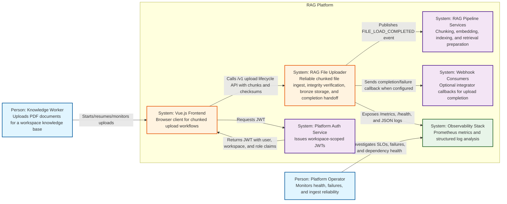
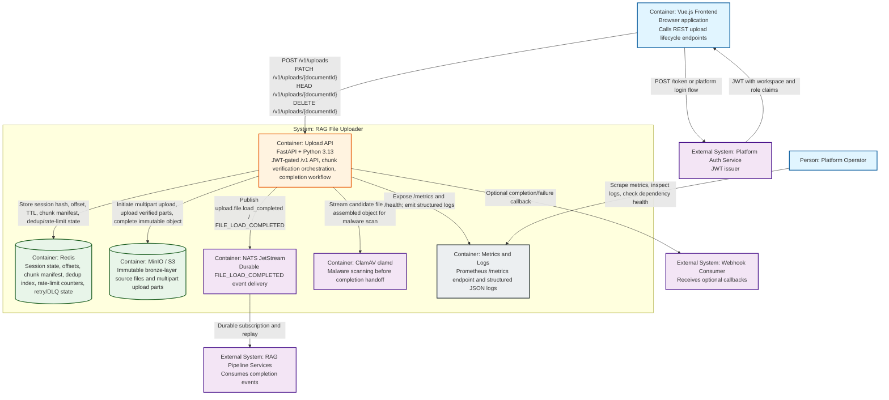

# RAG File Uploader - C4 Architecture

**Project:** rag-file-uploader

**Purpose:** Structural architecture views using the C4 model

**Related documents:** [Architecture Decision Document](./architecture.md), [Product Requirements Document](./prd.md), [Sequence Diagrams](./sequence-diagrams.md)

This document visualizes the RAG File Uploader architecture with the C4 model. It complements the sequence diagrams by showing static structure: who uses the system, which deployable/runtime containers exist, and how the planned FastAPI service is decomposed internally.

## Scope

| C4 level                | Included | Purpose                                                                         |
| ----------------------- | -------- | ------------------------------------------------------------------------------- |
| Level 1: System Context | Yes      | Show the RAG File Uploader in the broader RAG platform ecosystem.               |
| Level 2: Container      | Yes      | Show the FastAPI service and supporting infrastructure services.                |
| Level 3: Component      | Yes      | Show planned Clean Architecture components inside the FastAPI service.          |
| Level 4: Code           | Deferred | Code-level diagrams should be generated after the `src/` implementation exists. |

The diagrams use standard Mermaid `flowchart` syntax with C4-style boundaries and labels so they render in common Markdown viewers.

---

## Level 1: System Context

**Intent:** Show the RAG File Uploader as the ingestion boundary for the broader RAG platform.

### Context notes

The RAG File Uploader owns the reliability boundary for file ingress. It validates authentication and authorization on every request, verifies chunk integrity before accepting progress, persists resumable upload state, stores the final source file immutably in the bronze layer, scans for malware, and emits an explicit completion signal to downstream consumers.

The downstream RAG pipeline does not receive raw browser uploads. It consumes a stable `FILE_LOAD_COMPLETED` handoff after the source file is validated and stored.

---

## Level 2: Container

**Intent:** Show the runtime/deployable containers and external infrastructure used by the upload service.

### Container responsibilities

| Container        | Responsibility                                                                                                                | Key architectural requirement                                                       |
| ---------------- | ----------------------------------------------------------------------------------------------------------------------------- | ----------------------------------------------------------------------------------- |
| Upload API       | Owns HTTP API, authentication enforcement, upload orchestration, integrity checks, finalization, and dependency coordination. | Stateless service design; all resumable state lives outside the process.            |
| Redis            | Stores upload sessions, offsets, chunk manifests, deduplication fingerprints, rate-limit counters, and retry/DLQ state.       | 24-hour resumability window and tenant-scoped keys.                                 |
| MinIO/S3         | Stores multipart upload parts and final immutable bronze-layer source objects.                                                | Durable source-of-truth storage before downstream handoff.                          |
| NATS JetStream   | Delivers the `FILE_LOAD_COMPLETED` event to RAG pipeline consumers.                                                           | At-least-once durable event delivery with replay support.                           |
| ClamAV           | Scans uploaded content before the completion event is emitted.                                                                | Malware must be blocked before bronze-layer completion is considered successful.    |
| Metrics and Logs | Makes health, throughput, integrity failures, and operational errors visible.                                                 | Silent failures are unacceptable; operators must diagnose without SSH/log scraping. |

---

## Level 3: Component

**Intent:** Show the planned internal components of the FastAPI Upload API container using the Clean Architecture structure described in the architecture decision document.

```mermaid
flowchart TB
    Client["Vue.js Frontend"]

    subgraph ApiContainer["Container: Upload API - FastAPI + Python 3.13"]
        subgraph Presentation["Presentation Layer"]
            Routers["FastAPI Routers<br/>/v1 upload lifecycle endpoints, /health, /metrics"]
            Schemas["Pydantic API Schemas<br/>camelCase request/response contracts"]
            JwtMiddleware["JWT Auth Middleware<br/>Signature validation, workspace context, role enforcement"]
            ErrorHandlers["Error Handlers<br/>Consistent domain-to-HTTP responses"]
        end

        subgraph Application["Application Layer"]
            InitiateUseCase["InitiateUploadUseCase<br/>Validate metadata, create session, start multipart upload"]
            ProcessChunkUseCase["ProcessChunkUseCase<br/>Verify offset/checksum, persist progress, upload part"]
            CompleteUseCase["CompleteUploadUseCase<br/>Validate full file, scan, finalize, emit completion"]
            QueryAbortUseCases["Query/List/Abort Use Cases<br/>Resume offsets, metadata reads, cleanup"]
        end

        subgraph Domain["Domain Layer"]
            UploadSession["UploadSession Entity<br/>Lifecycle state, offsets, ownership"]
            Chunk["Chunk Value Objects<br/>Index, byte range, checksum, size"]
            VerificationService["ChunkVerificationService<br/>SHA-256 integrity rules"]
            DedupService["DeduplicationService<br/>Workspace-scoped file fingerprint logic"]
            Policies["Domain Policies<br/>File size, MIME type, role permissions, session expiry"]
            Ports["Protocols / Ports<br/>ISessionStore, IStorageClient, IEventPublisher, IVirusScanner"]
        end

        subgraph Infrastructure["Infrastructure Layer"]
            RedisStore["RedisSessionStore<br/>Session hashes, offsets, TTL, dedup, rate limits"]
            S3Client["S3StorageClient<br/>MinIO/S3 multipart and immutable object storage"]
            NatsPublisher["NATSEventPublisher<br/>FILE_LOAD_COMPLETED publication and retry"]
            ClamAvClient["ClamAVScanner<br/>clamd TCP scan integration"]
            WebhookPublisher["WebhookCallbackPublisher<br/>Optional callback delivery"]
            Observability["Metrics and Logging<br/>Prometheus counters, health checks, structured logs"]
            Config["Settings<br/>Pydantic BaseSettings environment config"]
        end
    end

    Redis[("Redis")]
    S3[("MinIO / S3")]
    NATS["NATS JetStream"]
    ClamAV["ClamAV clamd"]
    Webhooks["Webhook Consumers"]
    Prometheus["Prometheus / Log Pipeline"]

    Client --> Routers
    Routers --> JwtMiddleware
    Routers --> Schemas
    Routers --> InitiateUseCase
    Routers --> ProcessChunkUseCase
    Routers --> CompleteUseCase
    Routers --> QueryAbortUseCases
    ErrorHandlers --> Routers

    InitiateUseCase --> UploadSession
    InitiateUseCase --> Ports
    ProcessChunkUseCase --> UploadSession
    ProcessChunkUseCase --> Chunk
    ProcessChunkUseCase --> VerificationService
    ProcessChunkUseCase --> Ports
    CompleteUseCase --> UploadSession
    CompleteUseCase --> VerificationService
    CompleteUseCase --> DedupService
    CompleteUseCase --> Policies
    CompleteUseCase --> Ports
    QueryAbortUseCases --> UploadSession
    QueryAbortUseCases --> Ports
    JwtMiddleware --> Policies

    RedisStore -. implements .-> Ports
    S3Client -. implements .-> Ports
    NatsPublisher -. implements .-> Ports
    ClamAvClient -. implements .-> Ports
    WebhookPublisher -. implements .-> Ports

    RedisStore --> Redis
    S3Client --> S3
    NatsPublisher --> NATS
    ClamAvClient --> ClamAV
    WebhookPublisher --> Webhooks
    Observability --> Prometheus
    Routers --> Observability
    InitiateUseCase --> Observability
    ProcessChunkUseCase --> Observability
    CompleteUseCase --> Observability
    Config --> RedisStore
    Config --> S3Client
    Config --> NatsPublisher
    Config --> ClamAvClient

    classDef presentation fill:#e1f5ff,stroke:#01579b,stroke-width:2px
    classDef application fill:#fff3e0,stroke:#e65100,stroke-width:2px
    classDef domain fill:#f1f8e9,stroke:#33691e,stroke-width:2px
    classDef infrastructure fill:#f3e5f5,stroke:#4a148c,stroke-width:2px
    classDef external fill:#eceff1,stroke:#263238,stroke-width:2px

    class Routers,Schemas,JwtMiddleware,ErrorHandlers presentation
    class InitiateUseCase,ProcessChunkUseCase,CompleteUseCase,QueryAbortUseCases application
    class UploadSession,Chunk,VerificationService,DedupService,Policies,Ports domain
    class RedisStore,S3Client,NatsPublisher,ClamAvClient,WebhookPublisher,Observability,Config infrastructure
    class Client,Redis,S3,NATS,ClamAV,Webhooks,Prometheus external
```

### Component interaction rules

1. Presentation components depend on application use cases, not infrastructure clients.
2. Application use cases orchestrate domain entities/services and call dependency ports.
3. Domain components define lifecycle, validation, integrity, deduplication, authorization, and expiry rules without framework or vendor dependencies.
4. Infrastructure components implement the domain/application ports for Redis, S3-compatible storage, NATS, ClamAV, webhooks, and observability.
5. Infrastructure exceptions must be converted to domain/application errors at boundaries so API responses remain consistent.

---

## Cross-cutting quality attributes

| Quality attribute       | C4 elements                                                                    | Architecture rule                                                                                                             |
| ----------------------- | ------------------------------------------------------------------------------ | ----------------------------------------------------------------------------------------------------------------------------- |
| Security                | Vue.js Frontend, Platform Auth Service, JWT Auth Middleware, Domain Policies   | Every request is JWT-validated; write operations require owner role; workspace claims scope access.                           |
| Tenant isolation        | Upload API, Redis, MinIO/S3, DeduplicationService, Domain Policies             | Workspace ID is enforced in storage paths, Redis key prefixes, deduplication scope, rate limits, and authorization checks.    |
| Resumability            | Upload API, RedisSessionStore, UploadSession, Query/List/Abort Use Cases       | Redis stores offsets and chunk manifests with a 24-hour TTL so clients can resume from the last verified byte.                |
| Integrity               | ProcessChunkUseCase, CompleteUploadUseCase, ChunkVerificationService, MinIO/S3 | Per-chunk SHA-256 mismatches are rejected before progress is committed; full-file validation occurs before completion.        |
| Malware protection      | CompleteUploadUseCase, ClamAVScanner, ClamAV clamd                             | Files must be scanned before downstream completion handoff.                                                                   |
| Event decoupling        | NATSEventPublisher, NATS JetStream, RAG Pipeline Services                      | `FILE_LOAD_COMPLETED` is the stable handoff boundary; downstream processing is not coupled to upload request handling.        |
| Integration flexibility | WebhookCallbackPublisher, Webhook Consumers                                    | Webhook callbacks provide an alternate completion signal for consumers that cannot subscribe to NATS.                         |
| Observability           | Metrics and Logging, Prometheus / Log Pipeline, Platform Operator              | Metrics and structured logs expose throughput, bytes, checksum failures, dependency health, and upload lifecycle outcomes.    |
| Performance             | Upload API, ProcessChunkUseCase, Redis, MinIO/S3                               | Hot-path chunk processing must preserve the target per-chunk overhead for 5 MB chunks and support planned concurrent uploads. |

---

## Requirement traceability

| Architecture concept                   | Source requirement area                  | C4 location                                                             |
| -------------------------------------- | ---------------------------------------- | ----------------------------------------------------------------------- |
| REST chunked upload lifecycle          | Upload Session Management                | Container: Upload API; Components: FastAPI Routers and upload use cases |
| 24-hour resumability                   | Upload Resumability                      | Container: Redis; Components: RedisSessionStore and UploadSession       |
| SHA-256 chunk verification             | File Integrity and Validation            | Components: ProcessChunkUseCase and ChunkVerificationService            |
| Immutable bronze storage               | File Integrity and Validation            | Container: MinIO/S3; Component: S3StorageClient                         |
| ClamAV scanning                        | File Integrity and Validation / Security | Container: ClamAV; Component: ClamAVScanner                             |
| `FILE_LOAD_COMPLETED` event            | Pipeline Integration                     | Container: NATS JetStream; Component: NATSEventPublisher                |
| Webhook callbacks                      | Pipeline Integration                     | Component: WebhookCallbackPublisher; External System: Webhook Consumers |
| Workspace isolation                    | Workspace and Tenant Isolation           | Domain Policies, Redis key prefixes, S3 paths, JWT claims               |
| JWT authentication and authorization   | Authentication and Authorization         | Platform Auth Service, JWT Auth Middleware, Domain Policies             |
| Prometheus metrics and structured logs | Observability and Operations             | Metrics and Logs container; Metrics and Logging component               |
| Docker Compose dependency stack        | Capacity and Availability                | Container view: Upload API, Redis, MinIO/S3, NATS, ClamAV               |

---

## Code-level diagram status

C4 Level 4 is intentionally deferred. The repository currently documents a planned architecture and does not yet contain the implementation tree described in the architecture decision document. Once `src/` exists, code-level diagrams should be generated from real modules/classes rather than inferred from the plan.
