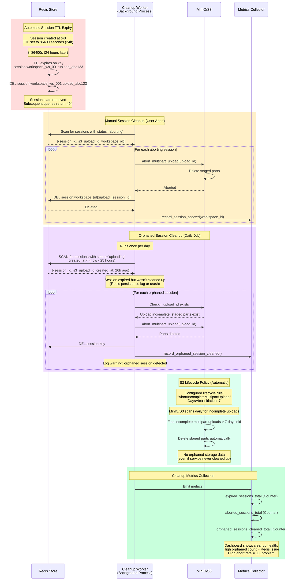

# RAG File Uploader - Additional Sequence Diagrams

**Continuation of sequence-diagrams.md**

---

## 16. Session Expiry & Cleanup

**Purpose:** Automatic and manual session lifecycle management



---

## Performance Budget Summary

**Critical Path Timing Annotations**

### Session Initiation Flow
```
Total Budget: <200ms p99

Breakdown:
├─ JWT Validation: 5-10ms (RS256 signature verify)
├─ File Size Validation: <1ms (simple integer check)
├─ S3 Initiate Multipart: 30-50ms (network round-trip)
├─ Redis Session Create: 1-2ms (HSET + EXPIRE)
├─ Response Serialization: <1ms
└─ Total: ~55ms (nominal), ~150ms (p99 with network variance)

Optimization opportunities:
- Cache JWT public key (reduces verify to <1ms after first load)
- Connection pool reuse for S3 (eliminates connection overhead)
- Redis pipelining for HSET+EXPIRE (single round-trip)
```

### Chunk Upload Flow
```
Total Budget: ≤100ms per 5MB chunk

Breakdown:
├─ JWT Validation: 1ms (cached key)
├─ Redis Get Session: 1-2ms (HGETALL)
├─ Offset Verification: <1ms (integer comparison)
├─ Network Read (5MB): 5-10ms (assuming 500Mbps+ network)
├─ SHA-256 Calculate: 15-25ms (CPU-bound, ~200MB/s throughput)
├─ Checksum Compare: <1ms
├─ S3 Upload Part: 30-50ms (5MB network write to S3)
├─ Redis Update Session: 1-2ms (HSET + HINCRBY in transaction)
└─ Total: ~80ms (nominal), ~100ms (p99)

Bottlenecks:
- SHA-256 calculation: CPU-bound, consider hardware acceleration
- S3 upload: Network-bound, bottleneck is S3 ingress bandwidth
- Parallelization potential: Calculate next chunk's SHA-256 while uploading current
```

### Offset Query Flow
```
Total Budget: <50ms p99

Breakdown:
├─ JWT Validation: 1ms (cached)
├─ Redis HGET offset: 1-2ms
├─ Response Serialization: <1ms
└─ Total: ~12ms (nominal), ~30ms (p99 with network variance)

This is a read-only hot path - extremely fast.
```

### Full Upload Completion (100MB file, 20 chunks)
```
Chunk uploads: 20 chunks × 80ms = 1600ms (1.6s)
S3 Complete Multipart: 100-200ms (assembly)
Full-File Download: 200-300ms (100MB read)
SHA-256 Full-File: 50-100ms (100MB hash)
ClamAV Scan: 500-1000ms (virus scan, varies by load)
NATS Publish Event: 10-20ms (network round-trip)
────────────────────────────────────────────────
Total: 2.5-3.3 seconds end-to-end

Note: Chunk uploads can be parallelized by client (reduce to <1s if 4-way parallel)
```

---

## PNG Export Instructions

To generate PNG images from these Mermaid diagrams for presentations:

### Method 1: Using mermaid-cli (mmdc)

```bash
# Install mermaid-cli
npm install -g @mermaid-js/mermaid-cli

# Create output directory
mkdir -p bmad/output/planning-artifacts/diagrams-png

# Export all diagrams (run from project root)
npx mmdc -i bmad/output/planning-artifacts/sequence-diagrams.md \
         -o bmad/output/planning-artifacts/diagrams-png/ \
         -t neutral \
         -b transparent

# Individual diagram export
npx mmdc -i diagram-section.md -o output.png -t neutral -b white -w 1920
```

### Method 2: Using GitHub (Automatic Rendering)

1. Push files to GitHub repository
2. View markdown files in GitHub web interface
3. Right-click on rendered diagram → "Save Image As..."
4. GitHub automatically renders Mermaid diagrams as SVG

### Method 3: Using VS Code Extension

1. Install "Markdown Preview Mermaid Support" extension
2. Open sequence-diagrams.md in VS Code
3. Open preview (Ctrl+Shift+V)
4. Right-click on diagram → "Copy Image" or "Save Image"

### Method 4: Using Online Tools

1. Go to https://mermaid.live/
2. Paste Mermaid code from diagram sections
3. Click "Download PNG" or "Download SVG"
4. Configure resolution and theme

### Recommended Settings for Presentations

```javascript
// For high-resolution presentation exports
{
  theme: 'neutral',        // Clean theme for presentations
  background: 'white',     // Solid background
  width: 1920,             // Full HD width
  height: 1080,            // Or auto-calculate from content
  scale: 2                 // 2x resolution for retina displays
}
```

### Batch Export Script

```bash
#!/bin/bash
# Save as: export-diagrams.sh

INPUT_FILE="bmad/output/planning-artifacts/sequence-diagrams.md"
OUTPUT_DIR="bmad/output/planning-artifacts/diagrams-png"

mkdir -p "$OUTPUT_DIR"

# Extract each diagram section and export
# Diagram 1: Architecture Overview
npx mmdc -i <(sed -n '/## 1\. Architecture Overview/,/^---$/p' "$INPUT_FILE") \
         -o "$OUTPUT_DIR/01-architecture-overview.png" \
         -w 1920 -b white -t neutral

# Diagram 2: Main Upload Flow
npx mmdc -i <(sed -n '/## 2\. Main Upload Flow/,/^---$/p' "$INPUT_FILE") \
         -o "$OUTPUT_DIR/02-main-upload-flow.png" \
         -w 1920 -b white -t neutral

# ... repeat for all diagrams
```

---

## Diagram Usage in Presentations

### PowerPoint/Keynote Integration

1. **Title Slide per Diagram**: Each diagram gets own slide with title
2. **Build Animation**: Reveal diagram in sections (use PNG layers)
3. **Call-out Boxes**: Highlight critical paths with colored boxes
4. **Performance Annotations**: Add timing labels to critical sections

### Documentation Integration

1. **Inline in Architecture Doc**: Embed PNGs in architecture.md
2. **Separate Appendix**: Create "Visual Architecture Appendix"
3. **Interactive HTML**: Use mermaid-live links for interactive exploration

### Code Review Usage

1. **PR Comments**: Link to specific diagram sections when reviewing flows
2. **Architecture Decision Records**: Include diagram PNG in ADR documents
3. **Onboarding Materials**: Use as visual guide for new developers

---

**Export Status:**
- [ ] PNGs generated (run mmdc after reviewing diagrams)
- [ ] Added to presentation deck
- [ ] Embedded in architecture.md
- [ ] Pushed to repository
