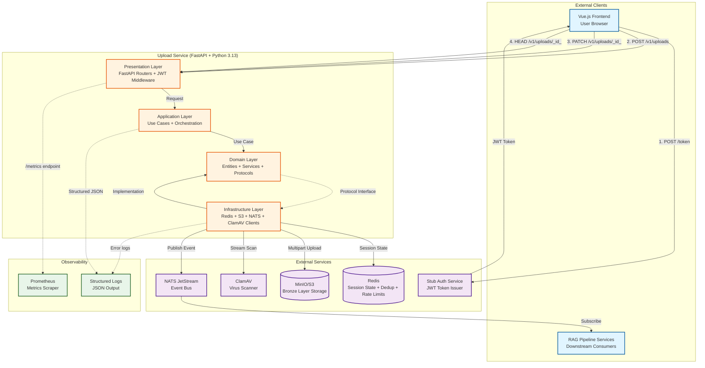
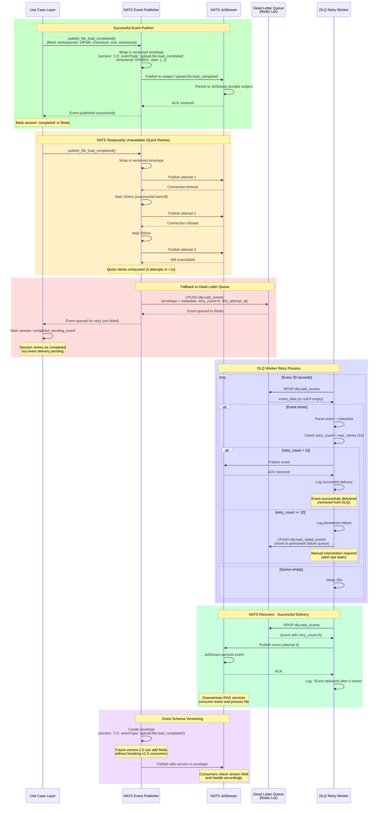
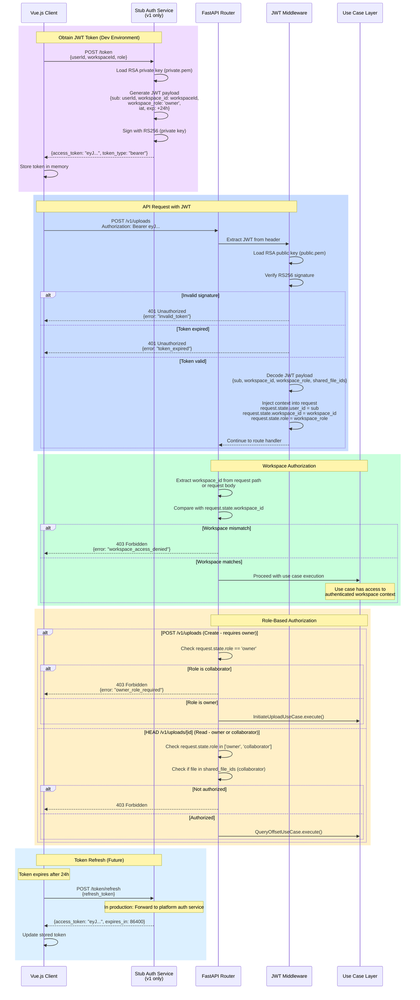

# RAG File Uploader - Sequence Diagrams

**Project:** rag-file-uploader  
**Date:** 2026-04-29  
**Purpose:** Visual documentation of service interactions and data flows

This document contains comprehensive sequence diagrams for all major flows in the RAG file uploader service, created using Mermaid notation.

---

## Table of Contents

### Core Flows

1. [Architecture Overview (High-Level)](#1-architecture-overview-high-level)
2. [Main Upload Flow (End-to-End) ⏱️](#2-main-upload-flow-end-to-end-)

### Component Integration Flows

3. [Upload Service ↔ Redis Interactions](#3-upload-service--redis-interactions)
4. [Upload Service ↔ S3/MinIO Interactions](#4-upload-service--s3minio-interactions)
5. [Upload Service ↔ NATS Interactions](#5-upload-service--nats-interactions)
6. [Upload Service ↔ ClamAV Interactions](#6-upload-service--clamav-interactions)

### Feature Flows

7. [JWT Authentication Flow](#7-jwt-authentication-flow)
8. [Upload Resume Flow](#8-upload-resume-flow)
9. [Deduplication Flow (Workspace-Scoped)](#9-deduplication-flow-workspace-scoped)
10. [Abort/Delete Upload Flow](#10-abortdelete-upload-flow)
11. [Rate Limiting Flow](#11-rate-limiting-flow)

### Observability Flows

12. [Metrics Collection Flow (Prometheus)](#12-metrics-collection-flow-prometheus)
13. [Health Check Endpoints](#13-health-check-endpoints)
14. [Structured Logging Flow](#14-structured-logging-flow)

### Error & Edge Case Flows

15. [Error Handling Flows](#15-error-handling-flows)
16. [Session Expiry & Cleanup](#16-session-expiry--cleanup)

**Legend:**

- ⏱️ = Includes performance timing annotations

---

## 1. Architecture Overview (High-Level)

**Purpose:** Simplified system architecture showing major components and data flow

**Key Architecture Principles:**

1. **Clean Architecture:** Presentation → Application → Domain ← Infrastructure (via Protocols)
2. **Protocol-Based Integration:** Domain defines interfaces, Infrastructure implements
3. **Async-First:** All I/O operations are non-blocking (FastAPI + httpx + aioboto3 + redis.asyncio)
4. **Multi-Tenant Isolation:** Workspace ID enforced at every layer
5. **Event-Driven:** Loose coupling via NATS events
6. **Fail-Safe:** DLQ retry logic, virus scanning, checksum verification

---

## 2. Main Upload Flow (End-to-End) ⏱️

**Flow:** User initiates file upload → chunks uploaded with verification → file assembled → virus scanned → event published

**Performance Budget (from NFRs):**

- Session initiation: <200ms p99
- Per-chunk processing: ≤100ms (5MB chunk)
- Offset query: <50ms p99
- Total 100MB file (20 chunks): ~2-3 seconds

```mermaid
sequenceDiagram
    participant User as Vue.js Client
    participant API as FastAPI Router
    participant Auth as JWT Middleware
    participant UC as Use Case Layer
    participant Redis as Redis Store
    participant S3 as MinIO/S3
    participant ClamAV as ClamAV Scanner
    participant NATS as NATS JetStream

    %% Step 1: Initiate Upload Session
    Note over User,Redis: ⏱️ Session Initiation (<200ms p99)
    User->>API: POST /v1/uploads
    Note right of API: {fileName, fileSize, checksum, workspaceId} | t=0ms
    API->>Auth: Validate JWT token
    Note right of Auth: t=5ms (RS256 verify)
    Auth->>Auth: Verify RS256 signature<br/>Extract workspace_id, role
    Auth-->>API: Token valid, context injected

    API->>UC: InitiateUploadUseCase.execute()
    Note right of UC: t=10ms
    UC->>UC: Validate file size ≤ 1GB<br/>Generate session_id (UUIDv4)
    UC->>S3: Initiate multipart upload
    Note right of S3: t=50ms (S3 API latency)
    S3-->>UC: upload_id returned
    UC->>Redis: Create session hash
    Note right of Redis: Key: session:workspace_[id]:upload_[id] | t=52ms (Redis: <2ms)
    Redis-->>UC: Session created (24h TTL)
    UC-->>API: {sessionId, uploadUrl, offset: 0}
    Note right of API: t=55ms (total)
    API-->>User: 201 Created + session details

    %% Step 2: Upload First Chunk
    Note over User,Redis: ⏱️ Chunk Upload (≤100ms per 5MB chunk)
    User->>API: PATCH /v1/uploads/[sessionId]
    Note right of API: Content-Type: application/offset+octet-stream<br/>Upload-Offset: 0<br/>Upload-Checksum: sha256 [hash] | t=0ms
    API->>Auth: Validate JWT (workspace owner?)
    Note right of Auth: t=5ms (cached key)
    Auth-->>API: Authorized

    API->>UC: ProcessChunkUseCase.execute()
    Note right of UC: t=8ms
    UC->>Redis: Get session state
    Note right of Redis: t=10ms (Redis: <2ms)
    Redis-->>UC: {offset: 0, chunks: [], status: 'uploading'}

    UC->>UC: Verify Upload-Offset matches session.offset
    Note right of UC: t=11ms
    UC->>UC: Read chunk bytes from request
    Note right of UC: t=15ms (5MB network read)
    UC->>UC: Calculate SHA-256 of received chunk
    Note right of UC: t=35ms (SHA-256: ~20ms for 5MB)
    UC->>UC: Compare with Upload-Checksum header

    alt Checksum mismatch
        UC-->>API: ChecksumMismatchError
        Note right of API: t=40ms (reject early)
        API-->>User: 460 Checksum Mismatch
    else Checksum valid
        UC->>S3: Upload part (chunk_index=1)
        Note right of S3: t=75ms (S3 write: ~40ms for 5MB)
        S3-->>UC: part_etag returned

        UC->>Redis: Update session
        Note right of Redis: HSET chunks: [{index:1, etag}]<br/>HINCRBY offset: chunk_size | t=77ms (Redis atomic: <2ms)
        Redis-->>UC: Updated

        UC-->>API: {offset: new_offset}
        Note right of API: t=80ms (total: within 100ms budget ✓)
        API-->>User: 204 No Content
        Note right of User: Upload-Offset: [new_offset]
    end

    %% Step 3: Upload More Chunks (loop)
    loop For each remaining chunk
        User->>API: PATCH /v1/uploads/[sessionId]
        Note right of API: Upload-Offset: [current_offset]<br/>Upload-Checksum: sha256 [hash]
        API->>Auth: Validate JWT
        Auth-->>API: Authorized
        API->>UC: ProcessChunkUseCase.execute()
        UC->>Redis: Get session + verify offset
        UC->>UC: Verify checksum
        UC->>S3: Upload part (chunk_index++)
        UC->>Redis: Update chunks + offset
        UC-->>User: 204 No Content
    end

    %% Step 4: Query Upload Progress (optional)
    Note over User,Redis: ⏱️ Offset Query (<50ms p99)
    User->>API: HEAD /v1/uploads/[sessionId]
    Note right of API: t=0ms
    API->>Auth: Validate JWT (collaborator can read)
    Note right of Auth: t=5ms
    Auth-->>API: Authorized
    API->>UC: QueryOffsetUseCase.execute()
    Note right of UC: t=7ms
    UC->>Redis: HGET session offset
    Note right of Redis: t=9ms (Redis: <2ms)
    Redis-->>UC: current_offset
    UC-->>API: offset value
    Note right of API: t=12ms (total: well under 50ms ✓)
    API-->>User: 200 OK
    Note right of User: Upload-Offset: [current_offset]<br/>Upload-Length: [file_size]

    %% Step 5: Complete Upload
    User->>API: PATCH /v1/uploads/[sessionId]
    Note right of API: Upload-Offset: [final_offset]<br/>(final chunk)
    API->>Auth: Validate JWT
    Auth-->>API: Authorized
    API->>UC: ProcessChunkUseCase.execute()
    UC->>UC: Detect offset == file_size (complete)
    UC->>S3: Complete multipart upload
    Note right of S3: (all part etags)
    S3-->>UC: Final S3 object created

    UC->>S3: Download assembled file
    S3-->>UC: File bytes stream
    UC->>UC: Calculate full-file SHA-256
    UC->>UC: Compare with initial checksum

    alt Full-file checksum mismatch
        UC->>S3: Delete corrupted file
        UC->>Redis: Mark session 'failed'
        UC-->>User: 500 Assembly Verification Failed
    else Full-file checksum valid
        UC->>ClamAV: Scan file for malware
        ClamAV-->>UC: Scan result: CLEAN

        alt Virus detected
            UC->>S3: Delete infected file
            UC->>Redis: Mark session 'failed_virus'
            UC-->>User: 400 Malware Detected
        else File clean
            UC->>Redis: Mark session 'completed'
            UC->>NATS: Publish FILE_LOAD_COMPLETED event
            Note right of NATS: {fileId, workspaceId, s3Path, checksum, size, timestamp}
            NATS-->>UC: Event published

            UC-->>API: Upload complete
            API-->>User: 200 OK
            Note right of User: {status: 'completed', fileId}
        end
    end

    Note over NATS: Downstream RAG services<br/>consume event and start<br/>chunking/embedding/indexing
```

---

## 2. Upload Service ↔ Redis Interactions

**Purpose:** Session state persistence, chunk tracking, deduplication, rate limiting

```mermaid
sequenceDiagram
    participant UC as Use Case Layer
    participant Redis as Redis Store

    %% Session Creation
    rect rgb(200, 220, 255)
        Note over UC,Redis: Session Creation (24h TTL)
        UC->>Redis: HSET session:workspace_{ws_id}:upload_{session_id}<br/>file_name, file_size, checksum, s3_upload_id,<br/>workspace_id, user_id, status='uploading',<br/>offset=0, chunks='[]', created_at
        Redis-->>UC: OK
        UC->>Redis: EXPIRE session:workspace_{ws_id}:upload_{session_id} 86400
        Redis-->>UC: OK (24h TTL set)
    end

    %% Get Session State
    rect rgb(200, 255, 220)
        Note over UC,Redis: Get Session State
        UC->>Redis: HGETALL session:workspace_{ws_id}:upload_{session_id}
        Redis-->>UC: {file_name, file_size, checksum, offset, chunks, status, ...}
    end

    %% Update Chunk Progress
    rect rgb(255, 240, 200)
        Note over UC,Redis: Update Chunk Progress (Atomic)
        UC->>Redis: MULTI (start transaction)
        UC->>Redis: HGET session:workspace_{ws_id}:upload_{session_id} chunks
        Redis-->>UC: current_chunks_json
        UC->>UC: Parse JSON, append new chunk {index, etag}
        UC->>Redis: HSET session:workspace_{ws_id}:upload_{session_id}<br/>chunks=updated_json
        UC->>Redis: HINCRBY session:workspace_{ws_id}:upload_{session_id}<br/>offset chunk_size
        UC->>Redis: EXEC (commit transaction)
        Redis-->>UC: Transaction committed
    end

    %% Check Deduplication (Workspace-Scoped)
    rect rgb(255, 220, 220)
        Note over UC,Redis: Check Deduplication (Workspace-Scoped)
        UC->>Redis: HEXISTS dedup:workspace_{ws_id} {sha256_hash}
        Redis-->>UC: 0 (not exists) or 1 (duplicate)

        alt File is duplicate
            UC->>Redis: HGET dedup:workspace_{ws_id} {sha256_hash}
            Redis-->>UC: existing_file_id
            UC-->>UC: Return duplicate file reference
        else File is new
            UC->>Redis: HSET dedup:workspace_{ws_id} {sha256_hash} {new_file_id}
            Redis-->>UC: OK
            Note over UC: Continue with upload
        end
    end

    %% Rate Limiting (Concurrent Uploads per Workspace)
    rect rgb(240, 220, 255)
        Note over UC,Redis: Rate Limiting Check (Atomic)
        UC->>Redis: GET rate_limit:workspace_{ws_id}:concurrent_uploads
        Redis-->>UC: current_count

        alt current_count >= max_concurrent_uploads
            UC-->>UC: Reject with 429 Too Many Requests
        else Under limit
            UC->>Redis: INCR rate_limit:workspace_{ws_id}:concurrent_uploads
            Redis-->>UC: new_count
            UC->>Redis: EXPIRE rate_limit:workspace_{ws_id}:concurrent_uploads 3600
            Redis-->>UC: OK (1h TTL)
            Note over UC: Proceed with upload
        end
    end

    %% Decrement Rate Limit (On Complete/Abort)
    rect rgb(220, 255, 240)
        Note over UC,Redis: Decrement Rate Limit
        UC->>Redis: DECR rate_limit:workspace_{ws_id}:concurrent_uploads
        Redis-->>UC: new_count
    end

    %% Mark Session Complete
    rect rgb(200, 255, 200)
        Note over UC,Redis: Mark Session Complete
        UC->>Redis: HSET session:workspace_{ws_id}:upload_{session_id}<br/>status='completed', completed_at={timestamp}
        Redis-->>UC: OK
        Note over Redis: Session still expires in 24h<br/>(historical record retention)
    end

    %% Session Expiry (Automatic)
    rect rgb(255, 200, 200)
        Note over UC,Redis: Automatic Session Expiry
        Note over Redis: After 24h TTL expires
        Redis->>Redis: DEL session:workspace_{ws_id}:upload_{session_id}
        Note over Redis: Expired sessions become<br/>non-resumable (API returns 404)
    end
```

---

## 3. Upload Service ↔ S3/MinIO Interactions

**Purpose:** Bronze-layer file storage using multipart upload protocol

```mermaid
sequenceDiagram
    participant UC as Use Case Layer
    participant S3 as MinIO/S3 Client
    participant Storage as MinIO Storage

    %% Initiate Multipart Upload
    rect rgb(200, 220, 255)
        Note over UC,Storage: Initiate Multipart Upload
        UC->>S3: create_multipart_upload()<br/>bucket='bronze-files',<br/>key='workspace_{ws_id}/files/{file_id}.pdf',<br/>metadata={workspace_id, user_id, original_name}
        S3->>Storage: CreateMultipartUpload API call
        Storage-->>S3: upload_id={unique_id}
        S3-->>UC: upload_id returned
        Note over UC: Store upload_id in Redis session
    end

    %% Upload Individual Parts (Chunks)
    loop For each chunk (part_number = 1, 2, 3, ...)
        rect rgb(220, 255, 220)
            Note over UC,Storage: Upload Part {part_number}
            UC->>S3: upload_part()<br/>bucket='bronze-files',<br/>key='workspace_{ws_id}/files/{file_id}.pdf',<br/>upload_id={upload_id},<br/>part_number={chunk_index},<br/>body={chunk_bytes}
            S3->>Storage: UploadPart API call
            Storage->>Storage: Store part in staging area
            Storage-->>S3: ETag={part_etag}
            S3-->>UC: part_etag returned
            Note over UC: Store {part_number, etag} in Redis
        end
    end

    %% Complete Multipart Upload (Assembly)
    rect rgb(200, 255, 200)
        Note over UC,Storage: Complete Multipart Upload
        UC->>UC: Retrieve all part etags from Redis<br/>Format: [{PartNumber: 1, ETag: '...'},<br/>{PartNumber: 2, ETag: '...'}, ...]
        UC->>S3: complete_multipart_upload()<br/>bucket='bronze-files',<br/>key='workspace_{ws_id}/files/{file_id}.pdf',<br/>upload_id={upload_id},<br/>parts=[{PartNumber, ETag}, ...]
        S3->>Storage: CompleteMultipartUpload API call
        Storage->>Storage: Assemble parts into single object
        Storage->>Storage: Apply server-side encryption (AES-256)
        Storage-->>S3: Object created successfully
        S3-->>UC: Final object metadata (size, etag)
        Note over UC: File now immutable in bronze layer
    end

    %% Download File for Verification
    rect rgb(255, 240, 200)
        Note over UC,Storage: Download for Full-File Checksum Verification
        UC->>S3: get_object()<br/>bucket='bronze-files',<br/>key='workspace_{ws_id}/files/{file_id}.pdf'
        S3->>Storage: GetObject API call
        Storage-->>S3: File byte stream
        S3-->>UC: File bytes (streaming)
        UC->>UC: Calculate SHA-256 of full file
        UC->>UC: Compare with original checksum

        alt Checksum mismatch
            Note over UC: File corrupted during assembly
            UC->>S3: delete_object()<br/>bucket='bronze-files',<br/>key='workspace_{ws_id}/files/{file_id}.pdf'
            S3->>Storage: DeleteObject API call
            Storage-->>S3: Deleted
            UC-->>UC: Raise AssemblyVerificationError
        else Checksum valid
            Note over UC: File integrity confirmed
        end
    end

    %% Abort Multipart Upload (Cleanup)
    rect rgb(255, 200, 200)
        Note over UC,Storage: Abort Multipart Upload (User Cancellation)
        UC->>S3: abort_multipart_upload()<br/>bucket='bronze-files',<br/>key='workspace_{ws_id}/files/{file_id}.pdf',<br/>upload_id={upload_id}
        S3->>Storage: AbortMultipartUpload API call
        Storage->>Storage: Delete all staged parts
        Storage-->>S3: Parts cleaned up
        S3-->>UC: Aborted successfully
        Note over UC: No storage consumed for aborted upload
    end

    %% Lifecycle Policy (Automatic Cleanup)
    rect rgb(240, 220, 255)
        Note over Storage: Automatic Incomplete Upload Cleanup
        Note over Storage: MinIO/S3 lifecycle policy:<br/>Delete incomplete multipart uploads<br/>after 7 days of inactivity
        Storage->>Storage: Scan for incomplete uploads > 7d old
        Storage->>Storage: Delete staged parts
        Note over Storage: Prevents orphaned data from<br/>abandoned uploads
    end
```

---

## 4. Upload Service ↔ NATS Interactions

**Purpose:** Event publishing with retry logic and dead letter queue

---

## 5. Upload Service ↔ ClamAV Interactions

**Purpose:** Malware scanning before event publication

```mermaid
sequenceDiagram
    participant UC as Use Case Layer
    participant Scanner as ClamAV Scanner Client
    participant ClamAV as ClamAV Daemon (clamd)
    participant S3 as MinIO/S3

    %% Scan Assembled File
    rect rgb(200, 220, 255)
        Note over UC,ClamAV: Scan File Before Event Publication
        UC->>UC: File assembly complete<br/>Full-file checksum verified
        UC->>Scanner: scan_file(file_id, s3_path)

        Scanner->>S3: Download file from S3
        S3-->>Scanner: File byte stream

        Scanner->>ClamAV: Connect to clamd (TCP socket)
        ClamAV-->>Scanner: Connection established

        Scanner->>ClamAV: Send INSTREAM command
        ClamAV-->>Scanner: Ready to receive

        Scanner->>ClamAV: Stream file bytes in chunks
        Note over Scanner,ClamAV: Streaming scan (no temp file)

        ClamAV->>ClamAV: Scan bytes against virus database
        ClamAV->>ClamAV: Check signatures
    end

    %% Clean File Result
    rect rgb(200, 255, 200)
        Note over Scanner,ClamAV: File is Clean
        ClamAV-->>Scanner: Response: "stream: OK"
        Scanner-->>UC: ScanResult.CLEAN
        UC->>UC: Proceed with event publication
        Note over UC: File is safe for downstream processing
    end

    %% Infected File Result
    rect rgb(255, 200, 200)
        Note over Scanner,ClamAV: Malware Detected
        ClamAV-->>Scanner: Response: "stream: {virus_name} FOUND"
        Scanner-->>UC: ScanResult.INFECTED<br/>virus_name={virus_name}

        UC->>S3: Delete infected file from S3
        S3-->>UC: File deleted
        UC->>UC: Mark session 'failed_virus' in Redis
        UC->>UC: Log security event<br/>{event: 'malware_detected',<br/>workspace_id, file_id, virus_name}
        UC-->>UC: Return error to user:<br/>400 Malware Detected
        Note over UC: No event published<br/>File removed from bronze layer
    end

    %% ClamAV Connection Failure
    rect rgb(255, 240, 200)
        Note over Scanner,ClamAV: ClamAV Unavailable
        Scanner->>ClamAV: Connect to clamd
        ClamAV--xScanner: Connection refused

        Scanner->>Scanner: Retry connection (3 attempts, 1s apart)
        Scanner->>ClamAV: Retry connect
        ClamAV--xScanner: Still unavailable

        Scanner-->>UC: ClamAVUnavailableError

        alt Strict scan policy (default)
            UC->>UC: Mark session 'failed_scan_unavailable'
            UC-->>UC: Return error: 503 Service Unavailable<br/>(virus scanning required)
            Note over UC: Fail-safe: Don't publish event<br/>if scan can't be performed
        else Lenient policy (config override)
            UC->>UC: Log warning: "Scan skipped - ClamAV unavailable"
            UC->>UC: Proceed with event publication (risk accepted)
            Note over UC: Only for dev/test environments<br/>NEVER in production
        end
    end

    %% Scan Timeout
    rect rgb(255, 220, 220)
        Note over Scanner,ClamAV: Scan Timeout (Large File)
        Scanner->>ClamAV: Stream file bytes
        ClamAV->>ClamAV: Scanning... (slow)
        Note over Scanner: Timeout after 60s (configurable)
        Scanner--xClamAV: Timeout - abort scan
        Scanner-->>UC: ScanTimeoutError

        UC->>UC: Mark session 'failed_scan_timeout'
        UC-->>UC: Return error: 500 Scan Timeout
        Note over UC: File may be too large or ClamAV overloaded<br/>Manual review required
    end

    %% ClamAV Health Check
    rect rgb(220, 240, 255)
        Note over Scanner,ClamAV: Health Check (Periodic)
        Scanner->>ClamAV: Send PING command
        ClamAV-->>Scanner: Response: "PONG"
        Scanner-->>Scanner: ClamAV healthy
        Note over Scanner: Used by /health/ready endpoint<br/>to report service readiness
    end
```

---

## 6. JWT Authentication Flow

**Purpose:** Workspace-scoped authentication and authorization

---

## 7. Upload Resume Flow

**Purpose:** Resume interrupted uploads using stored session state

```mermaid
sequenceDiagram
    participant Client as Vue.js Client
    participant API as FastAPI Router
    participant UC as Use Case Layer
    participant Redis as Redis Store
    participant S3 as MinIO/S3

    %% Initial Upload Started
    rect rgb(200, 220, 255)
        Note over Client,Redis: Initial Upload (Interrupted)
        Client->>API: POST /v1/uploads (initiate)
        API->>UC: InitiateUploadUseCase
        UC->>Redis: Create session (offset=0, chunks=[])
        UC->>S3: Initiate multipart upload
        UC-->>Client: {sessionId, uploadUrl, offset: 0}

        Client->>API: PATCH /v1/uploads/[sessionId]<br/>Upload-Offset: 0 (chunk 1)
        API->>UC: ProcessChunkUseCase
        UC->>S3: Upload part 1
        UC->>Redis: Update (offset=5242880, chunks=[{1, etag1}])
        UC-->>Client: Upload-Offset: 5242880

        Client->>API: PATCH /v1/uploads/[sessionId]<br/>Upload-Offset: 5242880 (chunk 2)
        API->>UC: ProcessChunkUseCase
        UC->>S3: Upload part 2
        UC->>Redis: Update (offset=10485760, chunks=[..., {2, etag2}])
        UC-->>Client: Upload-Offset: 10485760

        Note over Client: ❌ Network failure / browser crash
    end

    %% Query Current Offset (Determine Resume Point)
    rect rgb(255, 240, 200)
        Note over Client,Redis: Resume: Query Current Offset
        Note over Client: Client restarts, needs to know<br/>where to resume

        Client->>API: HEAD /v1/uploads/[sessionId]
        API->>UC: QueryOffsetUseCase.execute()
        UC->>Redis: HGETALL session:workspace_[id]:upload_{session_id}
        Redis-->>UC: {offset: 10485760, status: 'uploading', file_size: 104857600}
        UC-->>API: offset=10485760
        API-->>Client: 200 OK<br/>Upload-Offset: 10485760<br/>Upload-Length: 104857600

        Client->>Client: Calculate resumption:<br/>Bytes uploaded: 10485760<br/>Remaining: 94371840<br/>Resume from chunk 3
    end

    %% Resume Upload from Offset
    rect rgb(200, 255, 200)
        Note over Client,Redis: Resume: Continue Upload
        Client->>API: PATCH /v1/uploads/[sessionId]<br/>Upload-Offset: 10485760 (chunk 3)
        API->>UC: ProcessChunkUseCase.execute()

        UC->>Redis: Get current offset
        Redis-->>UC: offset=10485760
        UC->>UC: Verify Upload-Offset (10485760)<br/>matches session offset ✓

        UC->>UC: Verify chunk checksum
        UC->>S3: Upload part 3
        UC->>Redis: Update (offset=15728640, chunks=[..., {3, etag3}])
        UC-->>Client: 204 No Content<br/>Upload-Offset: 15728640

        Note over Client: Continue uploading remaining chunks<br/>until file complete
    end

    %% Resume Failure: Offset Mismatch
    rect rgb(255, 220, 220)
        Note over Client,Redis: Resume Failure: Offset Mismatch
        Client->>API: PATCH /v1/uploads/[sessionId]<br/>Upload-Offset: 999999 (incorrect)
        API->>UC: ProcessChunkUseCase.execute()
        UC->>Redis: Get current offset
        Redis-->>UC: offset=10485760
        UC->>UC: Compare Upload-Offset (999999) != offset (10485760)
        UC-->>API: OffsetMismatchError
        API-->>Client: 409 Conflict<br/>{error: "offset_mismatch",<br/>expected_offset: 10485760,<br/>provided_offset: 999999}
        Note over Client: Client must re-query offset<br/>and retry with correct value
    end

    %% Session Expired (24h TTL)
    rect rgb(255, 200, 200)
        Note over Client,Redis: Resume Failure: Session Expired
        Note over Redis: 24 hours pass since session creation
        Redis->>Redis: TTL expires, session deleted

        Client->>API: HEAD /v1/uploads/[sessionId]
        API->>UC: QueryOffsetUseCase.execute()
        UC->>Redis: HGETALL session:workspace_[id]:upload_{session_id}
        Redis-->>UC: (nil) - key not found
        UC-->>API: SessionNotFoundError
        API-->>Client: 404 Not Found<br/>{error: "session_expired",<br/>message: "Upload session expired after 24h"}

        Note over Client: Must initiate new upload session<br/>(re-upload entire file)
    end

    %% List All Active Sessions (Multi-File Resume)
    rect rgb(220, 240, 255)
        Note over Client,Redis: List Active Sessions (Multi-File Upload)
        Client->>API: GET /v1/uploads?workspaceId={ws_id}
        API->>UC: ListUploadsUseCase.execute()
        UC->>Redis: KEYS session:workspace_{ws_id}:upload_*
        Redis-->>UC: [session_id_1, session_id_2, session_id_3]

        loop For each session_id
            UC->>Redis: HGETALL session:workspace_{ws_id}:upload_[id]
            Redis-->>UC: {file_name, file_size, offset, status}
        end

        UC-->>API: Array of session metadata
        API-->>Client: 200 OK<br/>[{sessionId, fileName, bytesUploaded, totalSize, status}, ...]
        Note over Client: Display resume UI for each file
    end
```

---

## 8. Error Handling Flows

**Purpose:** Demonstrate error propagation and conversion across architectural layers

```mermaid
sequenceDiagram
    participant Client as Vue.js Client
    participant API as FastAPI Router
    participant Middleware as Error Handler Middleware
    participant UC as Use Case Layer
    participant Infra as Infrastructure Layer<br/>(Redis/S3/NATS)

    %% Domain Error: Checksum Mismatch
    rect rgb(255, 220, 220)
        Note over Client,UC: Domain Error: Checksum Mismatch
        Client->>API: PATCH /v1/uploads/[id]<br/>Upload-Checksum: sha256 {wrong_hash}
        API->>UC: ProcessChunkUseCase.execute()
        UC->>UC: Calculate chunk SHA-256
        UC->>UC: Compare with Upload-Checksum header
        UC->>UC: Mismatch detected
        UC-->>UC: Raise ChecksumMismatchError<br/>(domain exception)
        UC-->>API: ChecksumMismatchError propagates

        API->>Middleware: Exception caught by error handler
        Middleware->>Middleware: Map ChecksumMismatchError → 460 status<br/>Create response:<br/>{error: "checksum_mismatch",<br/>message: "Provided checksum does not match calculated",<br/>expectedChecksum, providedChecksum}
        Middleware-->>Client: 460 Checksum Mismatch<br/>(enhanced error response)

        Note over Client: Client logs error, may retry chunk upload
    end

    %% Infrastructure Error: Redis Connection Lost
    rect rgb(255, 240, 200)
        Note over Client,Infra: Infrastructure Error: Redis Unavailable
        Client->>API: PATCH /v1/uploads/[id]
        API->>UC: ProcessChunkUseCase.execute()
        UC->>Infra: RedisSessionStore.get_session()
        Infra->>Infra: Try to connect to Redis
        Infra--xInfra: ConnectionError: Redis unavailable

        Infra->>Infra: Catch ConnectionError<br/>at infrastructure boundary
        Infra-->>UC: Raise SessionStoreUnavailableError<br/>(domain exception - converted)
        UC-->>API: SessionStoreUnavailableError

        API->>Middleware: Exception caught
        Middleware->>Middleware: Map SessionStoreUnavailableError → 503<br/>{error: "service_unavailable",<br/>message: "Session store temporarily unavailable",<br/>retryAfter: 30}
        Middleware-->>Client: 503 Service Unavailable<br/>Retry-After: 30

        Note over Client: Client waits 30s and retries
    end

    %% Infrastructure Error: S3 Throttling
    rect rgb(255, 230, 200)
        Note over Client,Infra: Infrastructure Error: S3 Throttling
        Client->>API: PATCH /v1/uploads/[id]
        API->>UC: ProcessChunkUseCase.execute()
        UC->>UC: Verify checksum ✓
        UC->>Infra: S3StorageClient.upload_part()
        Infra->>Infra: Call aioboto3 upload_part()
        Infra--xInfra: ClientError: SlowDown (503)

        Infra->>Infra: Catch S3 ClientError<br/>Check error code == 'SlowDown'
        Infra->>Infra: Exponential backoff retry (3 attempts)
        Infra->>Infra: Retry attempt 1 (wait 500ms)
        Infra--xInfra: Still throttled
        Infra->>Infra: Retry attempt 2 (wait 1s)
        Infra--xInfra: Still throttled
        Infra->>Infra: Retry attempt 3 (wait 2s)
        Infra--xInfra: Max retries exceeded

        Infra-->>UC: Raise StorageThrottledError<br/>(domain exception - converted)
        UC-->>API: StorageThrottledError

        API->>Middleware: Exception caught
        Middleware->>Middleware: Map StorageThrottledError → 503<br/>{error: "storage_throttled",<br/>message: "Storage service overloaded",<br/>retryAfter: 60}
        Middleware-->>Client: 503 Service Unavailable<br/>Retry-After: 60
    end

    %% Application Error: File Size Exceeds Limit
    rect rgb(255, 200, 200)
        Note over Client,UC: Application Error: File Too Large
        Client->>API: POST /v1/uploads<br/>{fileSize: 2147483648} (2 GB)
        API->>UC: InitiateUploadUseCase.execute()
        UC->>UC: Validate file_size ≤ 1073741824 (1 GB)
        UC->>UC: Validation fails
        UC-->>UC: Raise FileSizeLimitExceededError<br/>(domain exception)
        UC-->>API: FileSizeLimitExceededError

        API->>Middleware: Exception caught
        Middleware->>Middleware: Map FileSizeLimitExceededError → 413<br/>{error: "file_too_large",<br/>message: "File size exceeds 1GB limit",<br/>maxSize: 1073741824,<br/>providedSize: 2147483648}
        Middleware-->>Client: 413 Payload Too Large
    end

    %% Authorization Error: Collaborator Attempts Write
    rect rgb(255, 220, 220)
        Note over Client,API: Authorization Error: Insufficient Permissions
        Client->>API: POST /v1/uploads<br/>Authorization: Bearer {token with role=collaborator}
        API->>Middleware: Validate JWT
        Middleware->>Middleware: Decode JWT<br/>role = 'collaborator'
        Middleware->>API: Inject context

        API->>API: Check role for POST endpoint<br/>Required: 'owner'<br/>Actual: 'collaborator'
        API-->>API: Authorization failed

        API->>Middleware: Raise InsufficientPermissionsError
        Middleware->>Middleware: Map InsufficientPermissionsError → 403<br/>{error: "forbidden",<br/>message: "Owner role required for this operation",<br/>requiredRole: "owner",<br/>actualRole: "collaborator"}
        Middleware-->>Client: 403 Forbidden
    end

    %% Unexpected Error: Unhandled Exception
    rect rgb(255, 200, 220)
        Note over Client,Middleware: Unexpected Error: Internal Server Error
        Client->>API: PATCH /v1/uploads/[id]
        API->>UC: ProcessChunkUseCase.execute()
        UC->>UC: Unexpected bug in code<br/>Raises unexpected exception
        UC--xAPI: Exception propagates (not domain exception)

        API->>Middleware: Unhandled exception caught by global handler
        Middleware->>Middleware: Log full stack trace<br/>{level: 'error', exception, context}
        Middleware->>Middleware: Check environment<br/>If production: hide details<br/>If development: include trace

        alt Production environment
            Middleware-->>Client: 500 Internal Server Error<br/>{error: "internal_server_error",<br/>message: "An unexpected error occurred",<br/>requestId: {uuid}}
        else Development environment
            Middleware-->>Client: 500 Internal Server Error<br/>{error: "internal_server_error",<br/>message: "...",<br/>stackTrace: "...",<br/>requestId: {uuid}}
        end

        Note over Middleware: Alert on-call engineer<br/>(P0 incident if >1% of requests)
    end
```

---

## Diagram Usage Guidelines

### For Implementation Teams

1. **Start with Main Upload Flow (Diagram 1)**: Understand the complete user journey from initiation to event publication

2. **Reference Component Diagrams (2-5)**: When implementing specific integrations, refer to the detailed interaction diagrams for Redis, S3, NATS, and ClamAV

3. **Authentication Implementation (Diagram 6)**: Follow JWT validation flow for all protected endpoints

4. **Resumability Features (Diagram 7)**: Implement offset query and resume logic per this specification

5. **Error Handling (Diagram 8)**: Apply consistent error conversion at architectural boundaries

### For Code Reviews

- Verify that implementations match the sequence flows documented here
- Check that all external service interactions follow the specified protocols
- Ensure error handling follows the infrastructure → domain exception conversion pattern

### For Testing

- Use these diagrams to create integration test scenarios
- Each "rect" block in the diagrams represents a testable scenario
- Focus on error paths (red blocks) for resilience testing

### For Documentation

- Reference specific diagram sections when writing API documentation
- Use diagram IDs when reporting bugs related to specific flows
- Update diagrams when architectural decisions change

---

**Document Version:** 1.0  
**Last Updated:** 2026-04-29  
**Maintained By:** Architecture Team
